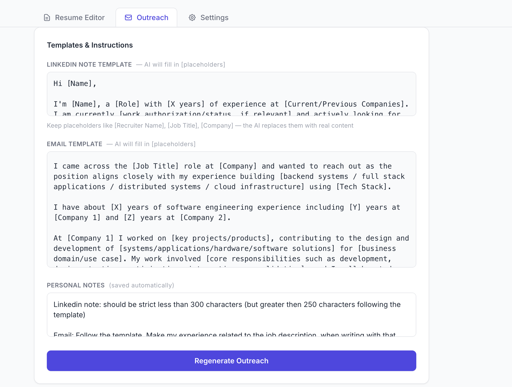
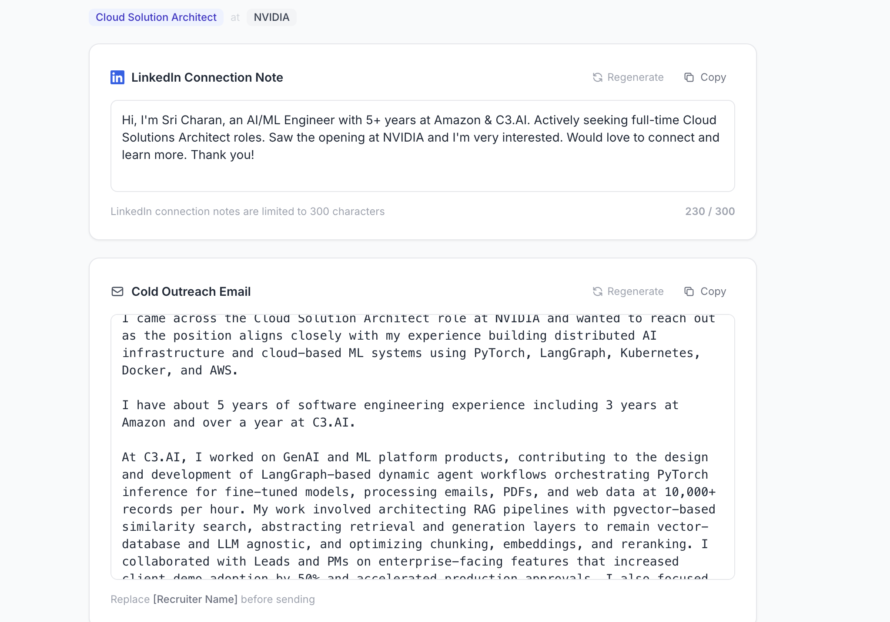
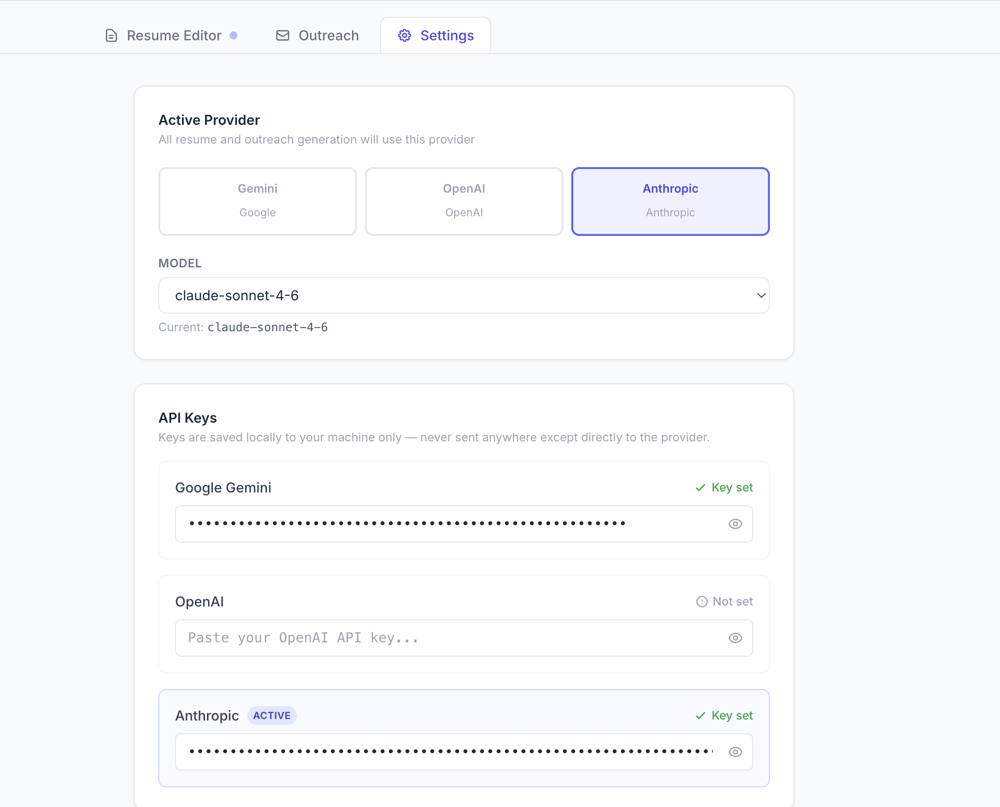

# Resume Editor

AI-powered resume tailoring and job outreach generator. Upload your resume, paste a job description, and get a tailored resume + personalized LinkedIn note and cold email — in under a minute.

---

## What it does

### ✦ Tailor your resume to any job
Upload your resume (PDF or DOCX), paste the job description, set your personal rules once — the AI rewrites your bullets, adds relevant tools, and fits everything to one page.



### ✦ Generate outreach in one click
Produces a LinkedIn connection note (under 300 chars) and a cold email — both filled from your actual resume and the JD. Regenerate each independently without touching the other.



### ✦ Bring your own API key
Works with Anthropic, OpenAI, or Google Gemini. Set your key once in the Settings tab — it stays in your browser, never on the server.



---

## Using the app

1. **Open the app** and go to **Settings** → add your API key (Anthropic / OpenAI / Gemini) and select a model
2. **Upload your resume** (PDF or DOCX) in the left panel
3. **Paste the job description** — or paste/upload a screenshot and the AI will extract the text
4. *(Optional)* Set **My Rules** — e.g. "keep to 1 page", "no hyphens", "quantify 60% of bullets"
5. Click **Edit Resume** → wait ~30s → review and download (PDF or DOCX)
6. Switch to **Outreach** → click **Generate Outreach** → copy your LinkedIn note and email

Your rules, templates, and notes are auto-saved. They persist across refreshes even if the server is down.

---

## Self-hosting

**Requirements:** Node.js 18+, Python 3.11+

```bash
# Backend
cd backend
python -m venv venv && source venv/bin/activate
pip install -r requirements.txt
uvicorn main:app --reload

# Frontend (new terminal)
cd frontend
npm install
npm run dev
```

Open [http://localhost:3000](http://localhost:3000) — add your API key in the Settings tab and you're good to go.

---

## Stack

| Layer | Tech |
|---|---|
| Frontend | Next.js 14, TypeScript, Tailwind CSS |
| Backend | FastAPI, Python 3.11 |
| LLMs | Anthropic Claude, OpenAI GPT-4o, Google Gemini |
| PDF gen | WeasyPrint |
| Resume parsing | pdfplumber, python-docx |
